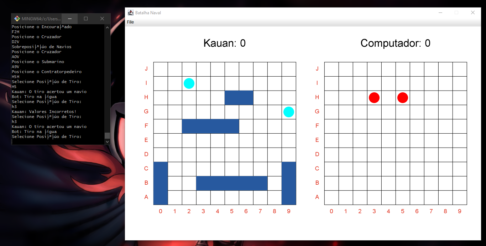
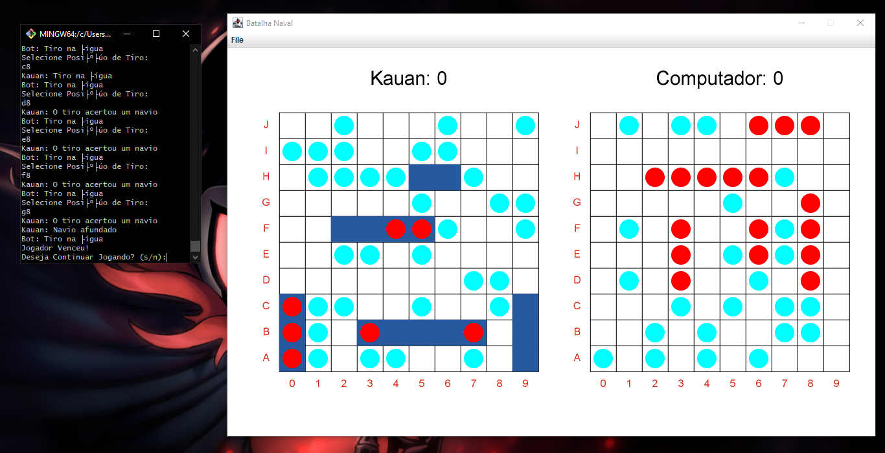
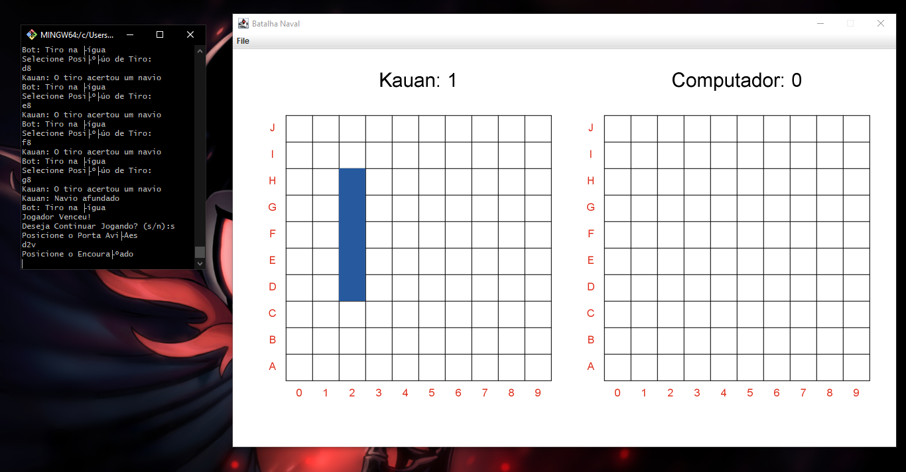
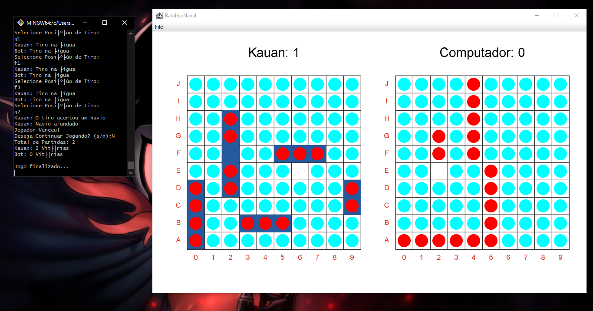
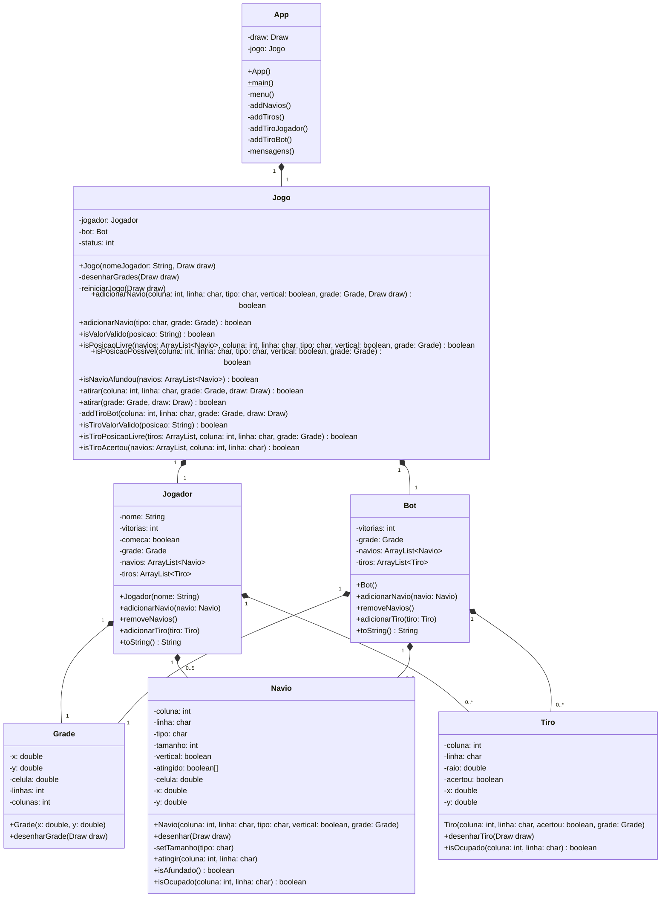

# Batalha Naval (Projeto 1)

## Como Jogar
1. O usuário digita o seu nome (Apenas o primeiro nome, nomes compostos são ignorados).
2. O terminal irá perguntar aonde o usuário irá inserir os navios, um de cada vez e o usuário deve escrever junto e nessa ordem a linha (uma letra entre A e J), a coluna (um número entre 0 e 9) e V para vertical e H para horizontal. ex: C3H
3. O terminal irá perguntar a coordenada do tiro, e o usuário deve escrever junto e nessa ordem a linha (uma letra entre A e J), a coluna (um número entre 0 e 9). ex: D4
4. Após um dos lados destruírem todos os navios adversários, o jogo pergunta ao usuário se ele quer iniciar uma nova rodada, S para resposta afirmativa N para resposta negativa.
5. Caso resposta afirmativa o jogo reinicia limpando o tabuleiro e os navios devem ser colocados de novo, e no momento do tiro inverte a ordem de quem começa.
6. Caso resposta negativa o jogo mostra quantas partidas foram jogadas e quantas cada um ganhou.

## O jogo

## Diagrama UML
