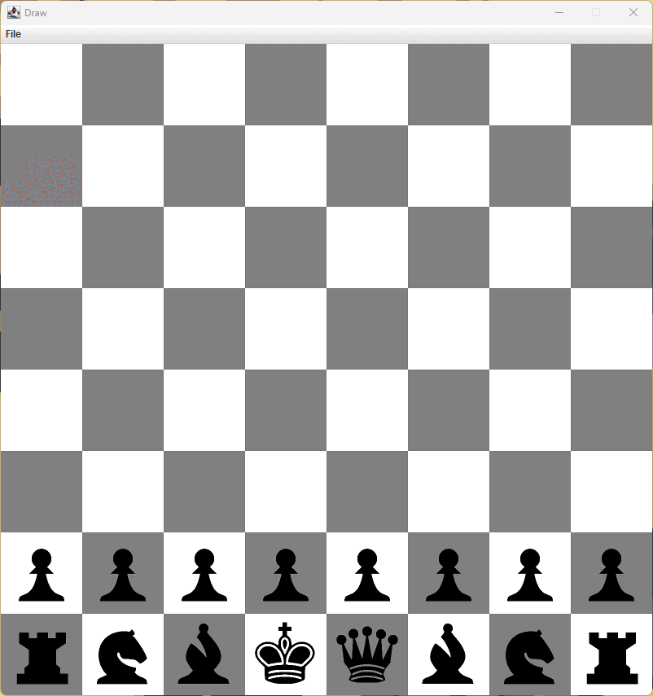
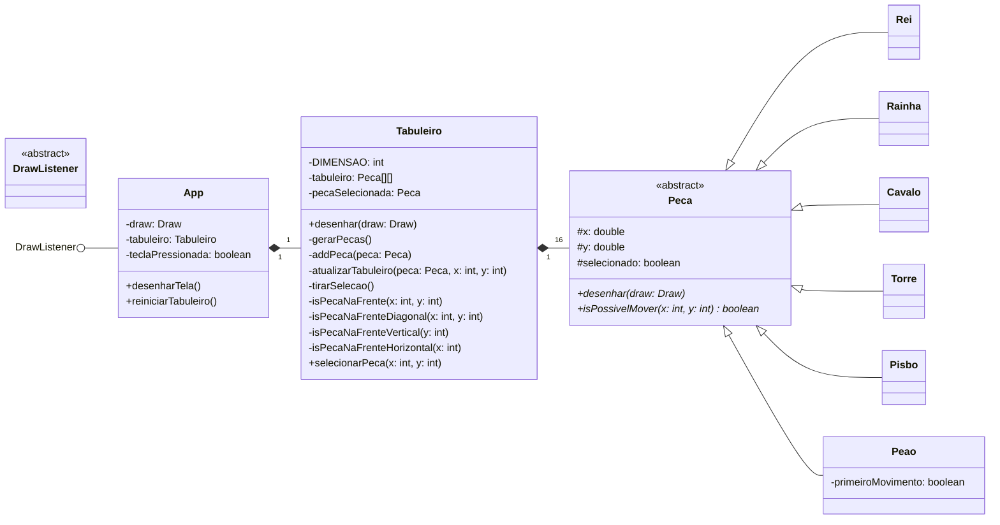

# Projeto 2 Xadrez

## Implementações
Todos os requisitos foram própriamente implementados.

## Galeria

## Diagrama de Classes

```mermaid
classDiagram
    
    direction LR
    
    DrawListener ()-- App
    App "1"*--"1" Tabuleiro
    Tabuleiro "1"*--"16" Peca
    Peca <|-- Rei
    Peca <|-- Rainha
    Peca <|-- Cavalo
    Peca <|-- Torre
    Peca <|-- Pisbo
    Peca <|-- Peao
     
    class DrawListener {
        <<abstract>>
    }
    
    class App {
        -draw: Draw
        -tabuleiro: Tabuleiro
        -teclaPressionada: boolean
        
        +desenharTela()
        +reiniciarTabuleiro()
    }
    
    class Tabuleiro {
        -DIMENSAO: int
        -tabuleiro: Peca[][]
        -pecaSelecionada: Peca
        
        +desenhar(draw: Draw)
        -gerarPecas()
        -addPeca(peca: Peca)
        -atualizarTabuleiro(peca: Peca, x: int, y: int)
        -tirarSelecao()
        -isPecaNaFrente(x: int, y: int)
        -isPecaNaFrenteDiagonal(x: int, y: int)
        -isPecaNaFrenteVertical(y: int)
        -isPecaNaFrenteHorizontal(x: int)
        +selecionarPeca(x: int, y: int)
    }
    
    class Peca {
        <<abstract>>
        #x: double
        #y: double
        #selecionado: boolean

        +desenhar(draw: Draw)*
        +isPossivelMover(x: int, y: int) boolean*
    }
    
    class Peao {
        -primeiroMovimento: boolean
    }
    
    class Cavalo {
        
    }
    
    class Torre {
        
    }
    
    class Pisbo {
        
    }
    
    class Rainha {
        
    }
    
    class Rei {
        
    }
```

