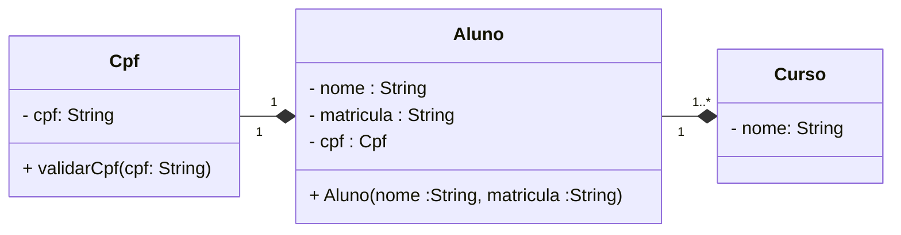

# Diagrama de classes UML

```mermaid
classDiagram
    
    direction LR
    Aluno "1" --* "1..*" Curso
    Cpf "1" --* "1" Aluno 
    
    class Aluno{
        - nome : String
        - matricula : String
        - cpf : Cpf
        
        + Aluno(nome :String, matricula :String)
    }
    
    class Cpf{
        - cpf: String
        
        + validarCpf(cpf: String)
    }
    
    class Curso{
        - nome: String
    }

```