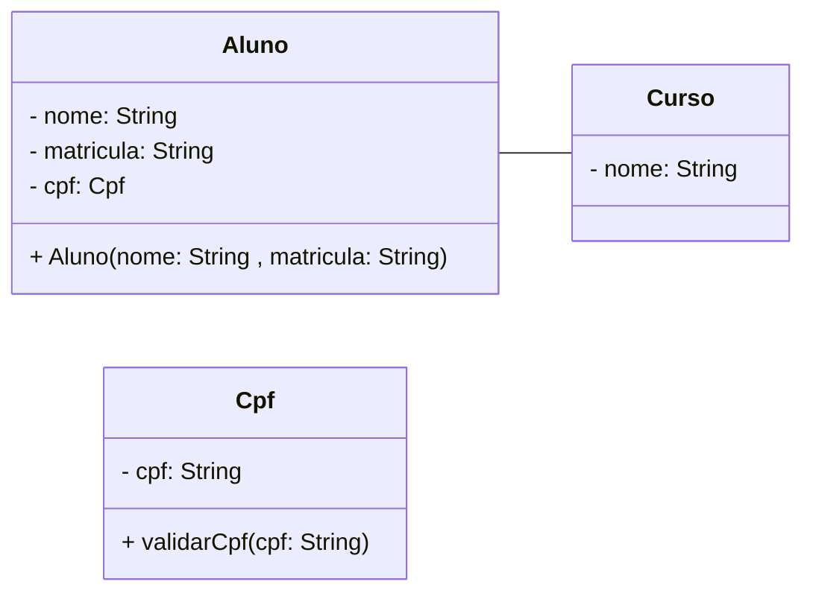

# Diagrama de classes UML

```mermaid
classDiagram
    
    direction LR
    Aluno -- Curso
    
    class Aluno{
        - nome: String
        - matricula: String
        - cpf: Cpf
        
        + Aluno(nome: String , matricula: String)
    }
    
    class Cpf{
        - cpf: String
        
        + validarCpf(cpf: String)
    }
    
    class Curso{
        - nome: String
    }

```