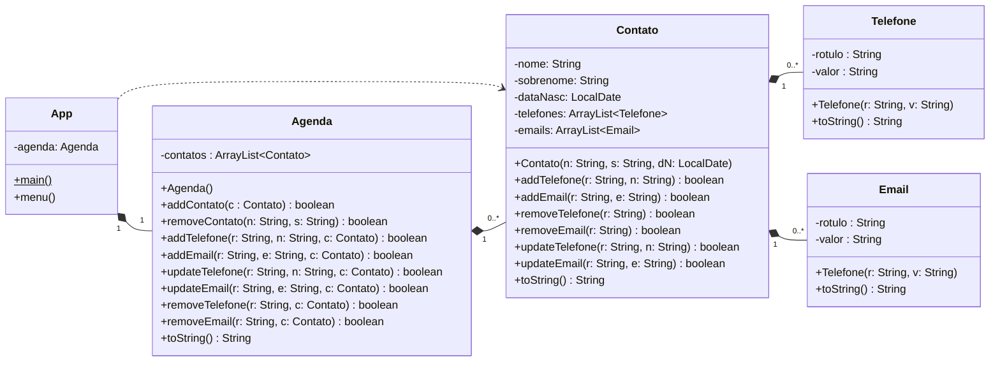

# Agenda Telefônica

```mermaid
classDiagram
    
    direction LR
    
    App "1" *-- "1" Agenda
    App ..> Contato
    Agenda "1" *-- "0..*" Contato
    Contato "1" *-- "0..*" Telefone
    Contato "1" *-- "0..*" Email
    
    class App{
        -agenda: Agenda
        +main()$
        +menu()
    }
    
    class Agenda{
        -contatos : ArrayList~Contato~
        
        +Agenda()
        +addContato(c : Contato) boolean
        +removeContato(n: String, s: String) boolean
        +addTelefone(r: String, n: String, c: Contato) boolean
        +addEmail(r: String, e: String, c: Contato) boolean
        +updateTelefone(r: String, n: String, c: Contato) boolean
        +updateEmail(r: String, e: String, c: Contato) boolean
        +removeTelefone(r: String, c: Contato) boolean
        +removeEmail(r: String, c: Contato) boolean
        +toString() String
    }

    class Contato{
        -nome: String
        -sobrenome: String
        -dataNasc: LocalDate
        -telefones: ArrayList~Telefone~
        -emails: ArrayList~Email~
        
        +Contato(n: String, s: String, dN: LocalDate)
        +addTelefone(r: String, n: String) boolean
        +addEmail(r: String, e: String) boolean
        +removeTelefone(r: String) boolean
        +removeEmail(r: String) boolean
        +updateTelefone(r: String, n: String) boolean
        +updateEmail(r: String, e: String) boolean
        +toString() String
    }
    
    class Telefone{
        -rotulo : String
        -valor : String
        
        +Telefone(r: String, v: String)
        +toString() String
    }
    
    class Email{
        -rotulo : String
        -valor : String

        +Telefone(r: String, v: String)
        +toString() String
    }

```