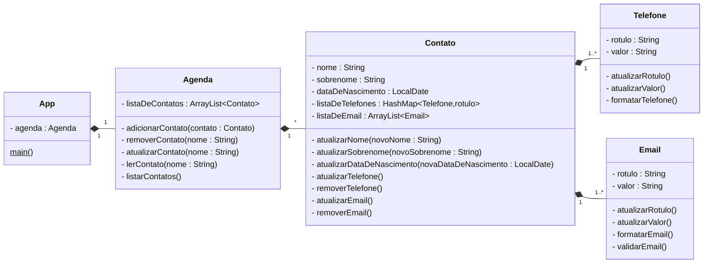

# Agenda Telefônica

```mermaid
classDiagram
    
    direction LR
    
    App "1" *-- "1" Agenda
    Agenda "1" *-- "*" Contato
    Contato "1" *-- "1..*" Telefone
    Contato "1" *-- "1..*" Email
    
    class App{
        - agenda : Agenda
        main()$
    }
    
    class Agenda{
        - listaDeContatos : ArrayList~Contato~
        
        - adicionarContato(contato : Contato)
        - removerContato(nome : String)
        - atualizarContato(nome : String)
        - lerContato(nome : String)
        - listarContatos()
    }

    class Contato{
        - nome : String
        - sobrenome : String
        - dataDeNascimento : LocalDate
        - listaDeTelefones : HashMap~Telefone,rotulo~
        - listaDeEmail : ArrayList~Email~
        
        - atualizarNome(novoNome : String)
        - atualizarSobrenome(novoSobrenome : String)
        - atualizarDataDeNascimento(novaDataDeNascimento : LocalDate)
        - atualizarTelefone()
        - removerTelefone()
        - atualizarEmail()
        - removerEmail()
    }
    
    class Telefone{
        - rotulo : String
        - valor : String
        
        - atualizarRotulo()
        - atualizarValor()
        - formatarTelefone()
    }
    
    class Email{
        - rotulo : String
        - valor : String

        - atualizarRotulo()
        - atualizarValor()
        - formatarEmail()
        - validarEmail()
    }

```