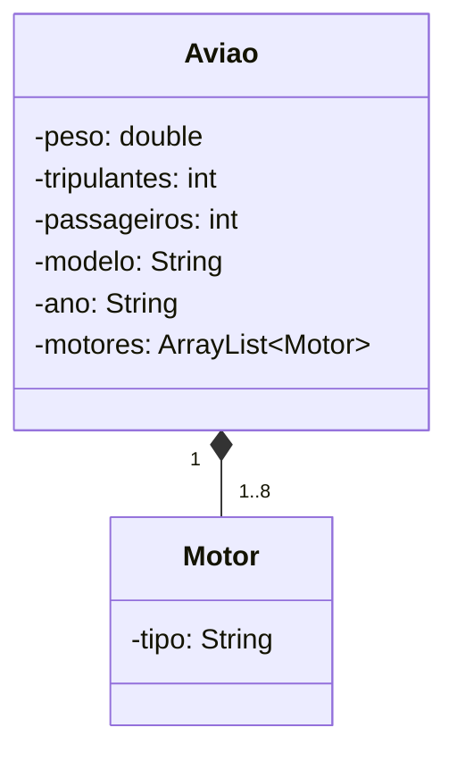
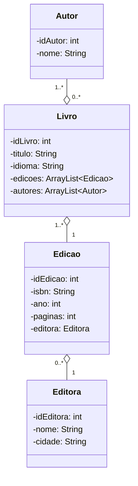
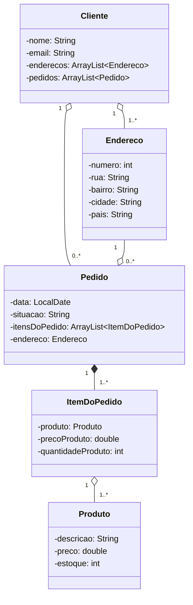
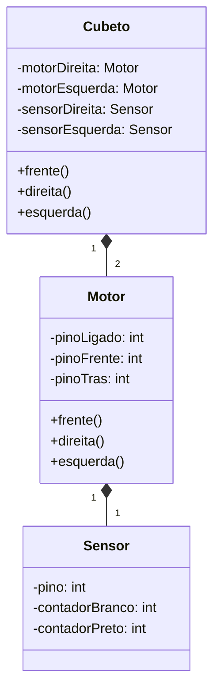

# Diagramas

## Jogo de Aviões:

```mermaid
classDiagram

Aviao "1"*--"1..8" Motor

class Aviao {
    -peso: double
    -tripulantes: int
    -passageiros: int
    -modelo: String
    -ano: String
    -motores: ArrayList~Motor~
}

class Motor {
    -tipo: String
}
```

## Livraria:

```mermaid
classDiagram

Autor "1..*"--o"0..*" Livro
Livro "1..*"o--"1" Edicao
Edicao "0..*"o--"1" Editora

class Livro{
    -idLivro: int
    -titulo: String
    -idioma: String
    -edicoes: ArrayList~Edicao~
    -autores: ArrayList~Autor~
}

class Editora {
    -idEditora: int
    -nome: String
    -cidade: String
}

class Autor {
    -idAutor: int
    -nome: String
}

class Edicao {
    -idEdicao: int
    -isbn: String
    -ano: int
    -paginas: int
    -editora: Editora
}
```

## Sistema de comércio eletrônico

```mermaid
classDiagram

Cliente "1"o--"0..*" Pedido
Pedido "1"*--"1..*" ItemDoPedido
ItemDoPedido "1"o--"1..*" Produto
Cliente "1"o--"1..*" Endereco
Endereco "1"--o"0..*" Pedido

class Produto {
    -descricao: String
    -preco: double
    -estoque: int
}

class Pedido {
    -data: LocalDate
    -situacao: String
    -itensDoPedido: ArrayList~ItemDoPedido~
    -endereco: Endereco
}

class ItemDoPedido {
    -produto: Produto
    -precoProduto: double
    -quantidadeProduto: int
 }

class Endereco {
    -numero: int
    -rua: String
    -bairro: String
    -cidade: String
    -pais: String
}

class Cliente {
    -nome: String
    -email: String
    -enderecos: ArrayList~Endereco~
    -pedidos: ArrayList~Pedido~
}
```

## Cubeto

```mermaid
classDiagram

Cubeto "1"*--"2" Motor
Motor "1"*--"1" Sensor

class Cubeto {
    -motorDireita: Motor
    -motorEsquerda: Motor
    -sensorDireita: Sensor
    -sensorEsquerda: Sensor
    
    +frente()
    +direita()
    +esquerda()
}

class Motor {
    -pinoLigado: int
    -pinoFrente: int
    -pinoTras: int
    
    +frente()
    +direita()
    +esquerda()
}

class Sensor {
    -pino: int
    -contadorBranco: int
    -contadorPreto: int
}
```