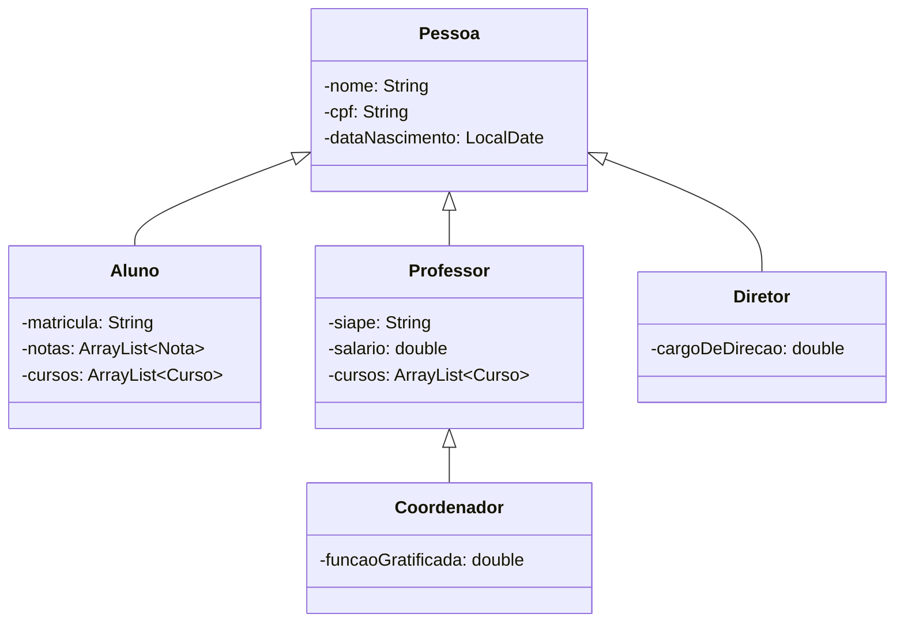
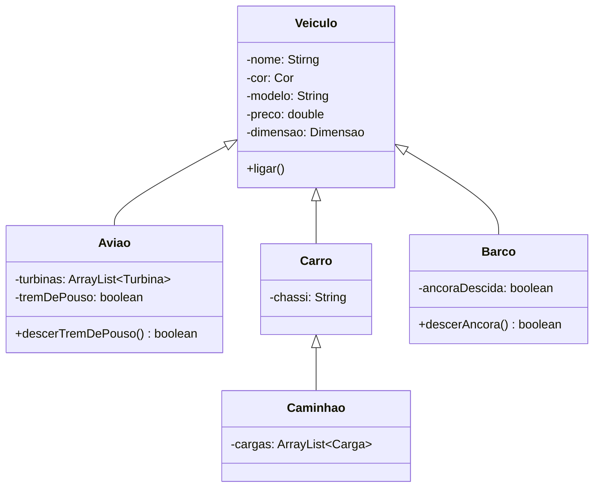
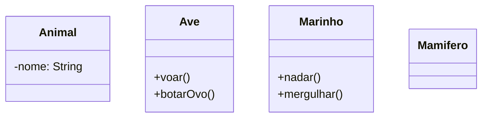

# Diagramas UML

## Aluno, Professor, Coordenador, Diretor:

```mermaid
classDiagram
    Pessoa <|-- Aluno
    Pessoa <|-- Professor
    Professor <|-- Coordenador
    Pessoa <|-- Diretor
    
    class Pessoa {
        -nome: String
        -cpf: String
        -dataNascimento: LocalDate
    }
    
    class Aluno {
        -matricula: String
        -notas: ArrayList~Nota~
        -cursos: ArrayList~Curso~
    }
    
    class Professor {
        -siape: String
        -salario: double
        -cursos: ArrayList~Curso~
    }
    
    class Coordenador {
        -funcaoGratificada: double
    }
    
    class Diretor {
        -cargoDeDirecao: double
    }

```

## Carro, Avião, Barco, Caminhão:

```mermaid
classDiagram
    
    Veiculo <|-- Aviao
    Veiculo <|-- Carro
    Veiculo <|-- Barco
    Carro <|-- Caminhao
    
    class Veiculo {
        -nome: Stirng
        -cor: Cor
        -modelo: String
        -preco: double
        -dimensao: Dimensao
        
        +ligar()
    }
    
    class Carro {
        -chassi: String
    }
    
    class Aviao {
        -turbinas: ArrayList~Turbina~
        -tremDePouso: boolean
        
        +descerTremDePouso() boolean
    }
    
    class Barco {
        -ancoraDescida: boolean
        
        +descerAncora() boolean
    }
    
    class Caminhao {
        -cargas: ArrayList~Carga~
    }

```

## Gato, Cachorro, Arara, Galinha, Baleia, Tubarao:

```mermaid
classDiagram
    
    class Animal {
        -nome: String
    }
    
    class Ave {
        +voar()
        +botarOvo()
    }
    
    class Marinho {
        +nadar()
        +mergulhar()
    }
    
    class Mamifero {
        
    }

```

