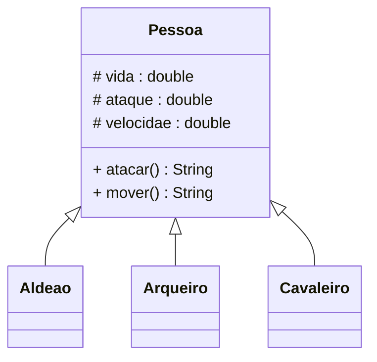

# Atividade de Herança de Classes

```mermaid
classDiagram

Pessoa <|-- Aldeao
Pessoa <|-- Arqueiro
Pessoa <|-- Cavaleiro

class Pessoa {
    # vida : double
    # ataque : double
    # velocidae : double
    
    + atacar() String
    + mover() String
}

class Aldeao {
    
}

class Arqueiro {
    
}

class Cavaleiro {
    
}

```